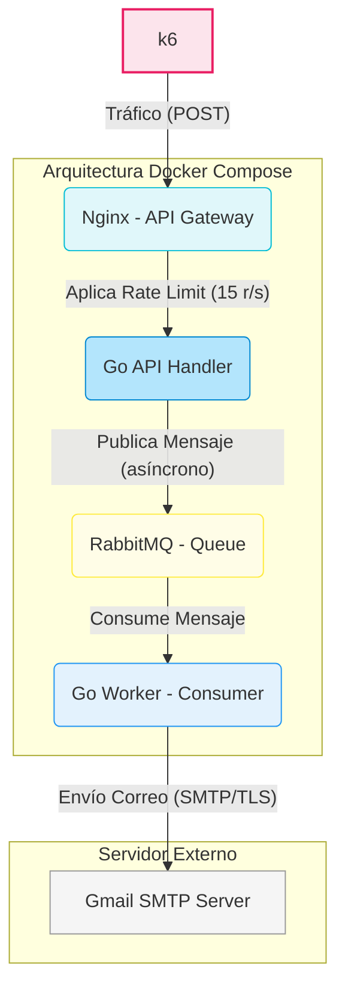

# Sistema de Alerta Temprana Vehicular (Reto 2)

## 1. Arquitectura:

La solución se implementó utilizando una arquitectura basada en **Microservicios y Cola de Mensajes**, orquestada con **Docker Compose**. Esta arquitectura fue diseñada específicamente para cumplir con los requisitos de rendimiento, disponibilidad, control de concurrencia y tasa máxima de peticiones.

#### Componentes Principales

*   **API Gateway (Nginx):** Actúa como el punto de entrada y aplica la táctica de **Rate Limiting** para definir un máximo de **15 peticiones por segundo**, cumpliendo el requisito no funcional.
*   **API Handler (Go):** Servicio ligero y rápido cuyo único propósito es recibir la petición del cliente y depositarla inmediatamente en la cola.
*   **Cola de Mensajes (RabbitMQ):** Implementa la táctica de **Queue-Based Load Leveling** para desacoplar el proceso de recepción del proceso de procesamiento (envío de correo), previniendo la sobrecarga del hilo principal del Programa en GO.
*   **Worker (Go):** Consume los mensajes de la cola y realiza la lógica de negocio (el envío del correo electrónico). Utiliza un **pool de workers concurrente** interno para limitar las instancias de procesamiento simultáneo a un máximo de **10**, cumpliendo la restricción de concurrencia del proyecto.

---

## 2. Atributo de Calidad: Disponibilidad y Rendimiento

El atributo de calidad más importante priorizado es la **Disponibilidad** y el **Rendimiento** bajo carga.

*   **Disponibilidad (bajo Carga):** La separación de responsabilidades a través de RabbitMQ asegura que, si el servicio SMTP externo o el Worker se ralentizan o fallan temporalmente, la entrada de datos (el API Handler) sigue disponible para recibir y encolar nuevos eventos, evitando la pérdida de datos y manteniendo el SLA de recepción.

---

## 3. Diagrama de Arquitectura



-----

## 4. Logs de Ejecución (Formato Requerido)

El código Go asegura que se generen logs para medir el tiempo de respuesta del correo. Este formato es esencial para la evaluación del Reto:

| Evento | Log Ejemplo |
| :--- | :--- |
| **Recepción de Emergencia** | `[LOG]: Recibido evento de emergencia para ABC-123 a las: 2025-12-08T21:17:05.123456789-05:00` |
| **Envío Exitoso del Correo** | `[LOG] Correo enviado exitosamente para ABC-123 a las: 2025-12-08T21:17:05.123987654-05:00` |


*   **Objetivo Latencia:** Menos de 15 segundos.
*   **Rendimiento Obtenido:** Promedio de 2 segundos.
*   **Cumplimiento Reto:** Requisito superado ampliamente.

-----

## 5. El Correo

*   **Destinatario:** Configurado mediante la variable de entorno `TARGET_EMAIL` en el **Docker Compose**. 
*   **Contenido:** El correo se genera indicando claramente que es una alerta de emergencia y contiene la placa, tipo de evento, y estado del vehículo.

El formato del correo es el siguiente:

```
To: [TARGET_EMAIL] Subject: Alerta de Emergencia - Vehículo [VehiclePlate]
Se ha detectado un evento de emergencia de tipo: Emergency para el vehículo con placa: [VehiclePlate]. con Estado: [Status]
```

## 6. Configuración

### A. Requisitos Previos (Instalación)

Asegurate de tener instalados los siguientes componentes:

*   **Go:** Lenguaje de programación.
*   **Docker** y **Docker Compose:** Para la orquestación de servicios (Go, RabbitMQ, Nginx).
*   **k6:** Herramienta de prueba de carga y rendimiento.

### B. Descarga y Preparación del Código

1.  **Clonar el Repositorio:**
    ```bash
    git clone [https://github.com/andgonzalezcas/go_emergency_system.git](https://github.com/andgonzalezcas/go_emergency_system.git)
    cd go_emergency_system
    ```

2.  **Configuración de Variables de Entorno (SMTP):**

    Debes editar el archivo **`docker-compose.yml`** y actualizar las siguientes variables de entorno dentro del servicio `receiver` para permitir el envío de correos:

    ```yaml
    # Fragmento a modificar en docker-compose.yml
    services:
      receiver:
        environment:
          SMTP_USERNAME: mail@gmail.com
          SMTP_PASSWORD: TU_CONTRASEÑA_O_APP_PASSWORD 
          TARGET_EMAIL: targetMail@gmail.com
    ```

### C. Ejecución del Sistema

1.  **Construir y Desplegar:** Levanta toda la arquitectura (servicios Go, RabbitMQ, Nginx) en segundo plano (`-d`):

    ```bash
    docker-compose up --build -d
    ```

2.  **Monitoreo de Logs:** Observa el proceso de recepción de emergencias y el inicio del envío de correos en el servicio `receiver`:

    ```bash
    docker-compose logs -f receiver
    ```

### D. Prueba de Carga (k6)

1.  **Modificar el Script de k6:**

    Ajusta el archivo **`k6-script.js`** para que refleje tu prueba. Asegúrate de que el *endpoint* de la petición apunte correctamente al api gateway (`http://localhost:8080/api/event`).

2.  **Ejecutar la Prueba:**

    Ejecuta el script de rendimiento con k6:

    ```bash
    k6 run k6-script.js
    ```